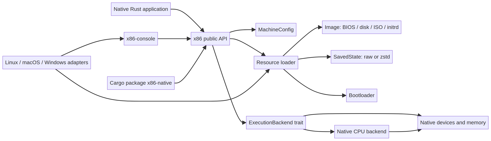

# Architecture

The diagram separates the project into four layers.

| Layer | Role |
| --- | --- |
| Application and console | Native Rust programs that configure a machine and present terminal output. |
| Public API | `Image`, `Resource`, `SavedState`, `MachineConfig` and `Machine`. |
| Execution boundary | `ExecutionBackend` for CPU, memory, interrupts and devices. |
| Platform adapters | Filesystem, networking and terminal integration for Linux, macOS and Windows. |

The machine host owns resources and lifecycle state, while the execution backend owns instruction stepping and device semantics. This separation keeps the core crate portable and avoids browser-specific assumptions.

The editable diagram source is [`architecture.mmd`](../assets/architecture.mmd). It can be rendered locally with `manus-render-diagram` or any Mermaid-compatible tool.
