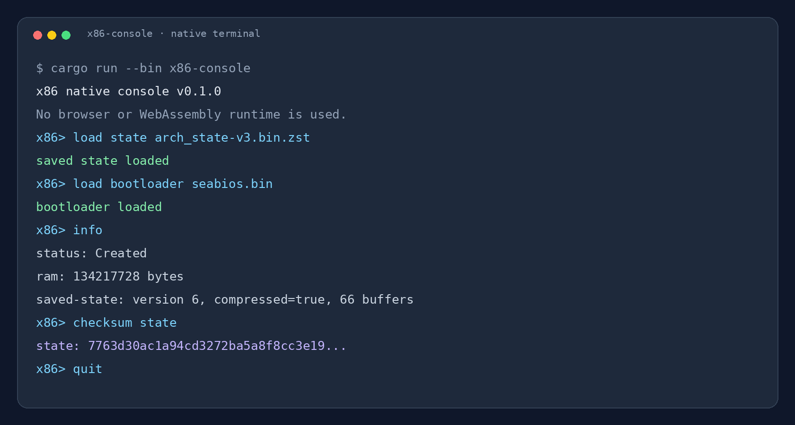

# Native console guide

Run the terminal application with:

```bash
cargo run --bin x86-console
```



The console is useful for inspecting resources before attaching a real execution backend. A typical session is:

```text
x86> capabilities
- raw-image-memory
- raw-image-file
- bootloader-file
- bootloader-http
- bootloader-https
- saved-state-v86-v6
- console-host-api
- backend-trait
- no-webassembly-runtime

x86> load state machine-state.bin.zst
saved state loaded
x86> load bootloader seabios.bin
bootloader loaded
x86> info
status: Created
saved-state: version 6, compressed=true, 66 buffers
x86> checksum state
state: <sha256>
x86> prepare
machine is not ready: no ExecutionBackend attached
x86> quit
```

The final error is expected until an implementation of `ExecutionBackend` is connected. The console intentionally distinguishes resource preparation from guest execution.
